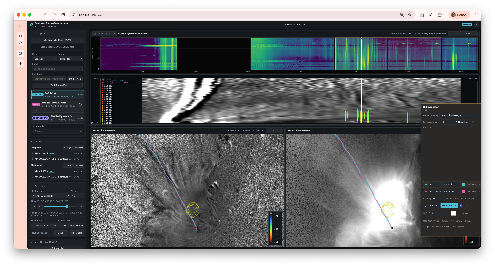

# SolRadViewer

**Explore solar radio images, dynamic spectra, and context imagery together.**

SolRadViewer is a local browser application for time-synchronized visualization and analysis of radio and context-image sequences. Compare image layers, overlay radio contours, follow evolving features, and extract time–distance maps and source measurements. Its workflow uses `context`, `radio`, and optional `spectrogram` roles rather than being restricted to supra-arcade downflows (SADs) or a single event.

The current readers support AIA-style context images and EOVSA-format radio products. Other instruments need compatible data products or an additional reader; the broader application name does not imply universal FITS support.



*Example workspace from the 2025-03-28 event: AIA 131 Å imagery, EOVSA radio contours and dynamic spectrum, and slit extraction. The supplied screenshot predates the SolRadViewer name. The observation files are not bundled.*

## Features

- Two image panels with configurable image layers and radio contour overlays.
- Synchronized playback across sources with different cadences, a frequency selector, and an interactive dynamic spectrum.
- Original images, subtraction, and ratios using previous frames, a base frame, or a mean image; display scaling, colormaps, and enhancement filters.
- Radio alignment offsets, per-channel adjustments and masks, and contour levels relative to frame or global peaks.
- Straight or curved slits and fan families for time–distance analysis, plus pixel light curves.
- Region selection, feature tracking, and radio peak/centroid extraction.
- Saved JSON sessions and CSV analysis exports.

## Install and launch

Requires **Python 3.10–3.12**, **Node.js 22.12+** (or Node 20.19+), npm, and Git. The launch scripts use Bash, `curl`, and `lsof`; on Windows, use WSL. Science dependencies are installed by pip.

```bash
git clone https://github.com/sageyu123/solradviewer.git
cd solradviewer
python3 -m venv .venv
source .venv/bin/activate
python -m pip install -e ".[test]"
npm install --prefix frontend
./run_app.sh
```

Open **[http://127.0.0.1:5174](http://127.0.0.1:5174)**. The backend listens on port **8010**. Press `Ctrl+C` in the launch terminal to stop both services.

To use an existing Python environment, activate it and skip virtual-environment creation. You can also select an interpreter explicitly:

```bash
PYTHON=/path/to/python ./run_app.sh
```

For a checkout on a cloud-synced drive, keeping the Python environment outside that drive can improve startup speed. Individual launchers `./run_backend.sh` and `./run_frontend.sh` are available for debugging. The combined launcher stops existing listeners on ports 8010 and 5174 before starting; choose those ports only for this app.

## Currently supported data

| Role / data | Manifest format | Required layout |
| --- | --- | --- |
| Context: AIA FITS image sequence | `aia-fits-sequence` | A directory of 2-D FITS images with solar WCS and observation timestamps. Configurable filename `pattern`, `hdu` (default 1), and `timeKey` (default `T_OBS`; date-header fallbacks are supported). |
| Context: AIA-style HDF5 map sequence | `hdf` | `map_sequence/map_<index>/data` datasets, each with a JSON `meta` attribute containing map metadata and an observation time. Supply `paths.intensity` and `paths.diff`; generic HDF5 arrays are not sufficient. |
| Radio: EOVSA all-band FITS sequence | `eovsa-fits-sequence` (examples also use `fits`) | A directory with one FITS file per time. HDU 1 contains a `(frequency, y, x)` image cube, solar WCS, and an observation time. HDU 2 contains `cfreqs` and `cdelts` in Hz. Set a filename `pattern` for your event. |
| Spectrogram: EOVSA dynamic spectrum | `fits` | Primary-HDU array shaped `(frequency, time)`, HDU 1 table column `FGHZ` in GHz, and HDU 2 table column `TIME` in Julian days. Optional for a session. |
| Session / dataset description | JSON | A manifest with source roles and local file paths, or a saved app session. JSON references science files; it does not contain them. |

A working analysis session currently requires both a supported context source and a supported radio source. The role-based UI does not yet provide arbitrary context-only, radio-only, or multi-instrument loaders. Unknown extra-source formats may appear as placeholders rather than usable image layers.

OVRO-LWA, LOFAR, VLA, Measurement Sets, CASA image directories, arbitrary FITS cubes, generic NPZ arrays, and ordinary PNG/JPEG context images do **not** have dedicated readers in this version. The example filename `ovro_lwa_20250328_cme.json` names the research event; its actual sources are AIA and EOVSA.

## Load your data

1. Copy an example manifest to a private local file, for example:

   ```bash
   cp manifests/ovro_lwa_20250328_cme.json manifests/my-event.local.json
   ```

2. Replace every `/path/to/data/...` placeholder with a real path on the machine running the backend. Adjust patterns, labels, and event times.
3. Start the app and choose **Load Manifest / JSON**, or drag the JSON file into the Data panel.
4. Select image layers, set the time range, and inspect the radio frequencies and overlays. Draw a slit to extract a time–distance map, or select a region for tracking and source extraction.
5. Save a session to retain the setup, or export the analysis products.

The browser sends file paths to the local backend; it does not upload the science files. Use absolute paths for portable, unambiguous manifests. Relative paths resolve from the backend's working directory (the repository root when launched with the scripts), **not** from the JSON file's location. Shell variables inside JSON strings are not expanded.

A minimal FITS-sequence example:

```json
{
  "version": 2,
  "event": {
    "id": "my-event",
    "label": "My solar event"
  },
  "sources": [
    {
      "id": "context",
      "role": "context",
      "label": "AIA 131 Å",
      "format": "aia-fits-sequence",
      "paths": { "directory": "/path/to/data/aia" },
      "pattern": "*.fits",
      "hdu": 1,
      "timeKey": "T_OBS"
    },
    {
      "id": "radio",
      "role": "radio",
      "label": "Radio images",
      "format": "eovsa-fits-sequence",
      "paths": { "directory": "/path/to/data/radio" },
      "pattern": "*.allbd.fits"
    },
    {
      "id": "spectrum",
      "role": "spectrogram",
      "label": "Dynamic spectrum",
      "format": "fits",
      "path": "/path/to/data/spectrum.fits"
    }
  ]
}
```

Remove the spectrogram entry if no compatible spectrum is available. For HDF5 context data, replace the context entry with:

```json
{
  "id": "context",
  "role": "context",
  "label": "Context images",
  "format": "hdf",
  "paths": {
    "intensity": "/path/to/data/intensity.h5",
    "diff": "/path/to/data/running-ratio.h5"
  }
}
```

Example manifests are provided for the [2022-01-18 flare](manifests/eovsa_20220118_mflare.json) and [2025-03-28 event](manifests/ovro_lwa_20250328_cme.json). They are templates, not downloadable or bundled datasets. The optional `seeds` field in the older flare example references a legacy tracking pickle; omit it if unused and load only trusted pickle files.

To automatically load a manifest at launch, pass a unique part of its filename:

```bash
./run_app.sh my-event
```

This searches `manifests/*.json`; unknown or ambiguous keys are rejected. Files in the ignored `manifests/local/` folder can be loaded through the UI.

## Local data and configuration

No personal disk mount is required. The application starts without observation files; loading a session requires your data. Set environment variables **before** starting the backend. They are not read automatically from a `.env` file.

| Variable | Default / purpose |
| --- | --- |
| `PYTHON` | Optional interpreter override for the backend launcher; otherwise it uses `.venv/bin/python` when present, then Python on `PATH`. |
| `SOLRADVIEWER_DATA_ROOT` | `data/EOVSA_20220118_Mflare` under the checkout. Root for the legacy sample only; it does not rewrite paths in manifests. |
| `SOLRADVIEWER_OUTPUT_ROOT` | `outputs/` under the checkout. Session exports and analysis products. |
| `SOLRADVIEWER_CACHE_DIR` | `~/.cache/solradviewer`. Render cache, with decoded image data in its `decoded-planes/` subdirectory. |
| `SOLRADVIEWER_RENDER_CACHE_BYTES` | `2147483648` (2 GiB). Render-cache budget; use `0` to disable it. |
| `SOLRADVIEWER_DECODED_STORE_GB` | `24` GiB. Decoded-image cache budget, allocated as data are read; use `0` to disable it. |

Existing `SAD_EOVSA_RENDER_CACHE_DIR`, `SAD_EOVSA_RENDER_CACHE_BYTES`, and `SAD_EOVSA_DECODED_STORE_GB` settings remain accepted. Byte-based `SOLRADVIEWER_DECODED_CACHE_BYTES` / `SAD_EOVSA_DECODED_CACHE_BYTES` are fallback settings when no valid GiB budget is provided.

The legacy sample action expects the 2022-01-18 files under the configured sample-data root, using the relative layout shown in its example manifest. Normal manifest loading uses the paths you provide directly.

Science data, `outputs/`, logs, local environments, `manifests/local/`, `manifests/*.local.json`, and exported `*_session_*.json` files are ignored by Git. Keep your private manifests in those locations. Saved sessions contain local paths; review them before sharing.

Exports include `feature_tracks.csv` and `radio_sources.csv` under `outputs/<session-id>/`. Legacy `sad_tracks.csv` and `eovsa_sources.csv` aliases remain for compatibility.

## Development and checks

```bash
python -m unittest discover -s sad_eovsa_tool/backend/tests
npm run build --prefix frontend
```

Most backend checks create small synthetic data files. The original observational workflow tests skip when the optional sample dataset is unavailable. With the app running, check both services:

```bash
curl http://127.0.0.1:8010/api/health
curl http://127.0.0.1:5174/api/health
```

The backend uses FastAPI, NumPy/SciPy, Astropy, SunPy, and h5py; the frontend uses React, TypeScript, and Vite. Reader implementations live in [`sad_eovsa_tool/backend/data.py`](sad_eovsa_tool/backend/data.py), and API routes in [`sad_eovsa_tool/backend/app.py`](sad_eovsa_tool/backend/app.py).

The Python import namespace `sad_eovsa_tool`, existing API routes, and saved-session fields remain unchanged so existing workflows continue to work. The application and Python/npm distribution names are now **SolRadViewer** / `solradviewer`. Historical design notes under `docs/design/` describe earlier proposals and may differ from current behavior.
